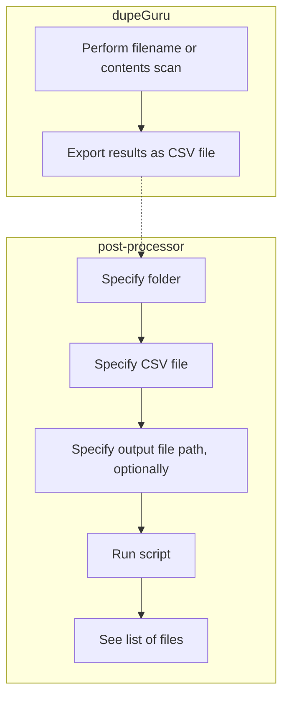

# dupeguru-post-processor

`dupeguru-post-processor` is a Python script that can be used to compare a folder on your computer to a set of dupeGuru results. Specifically, it can be used to determine which files in the folder are not listed in the CSV file; effectively, identifying the files of which dupeGuru found _no_ duplicates.

[dupeGuru](https://github.com/arsenetar/dupeguru) is a tool that can be used to identify duplicate files among two or more folders. The creation of this "post-processing" script was inspired by [this GitHub issue](https://github.com/arsenetar/dupeguru/issues/218).

# Workflow



This script was developed using Python version 3.10.

# Usage

Display usage information:

```shell
python main.py --help
```

Examples:

```shell
# Absolute paths are OK:
python main.py /path/to/folder /path/to/dupelist.csv

# Relative paths are OK (so is a trailing slash on the folder):
python main.py ./folder/ ./dupelist.csv

# Mixing and matching relative/absolute paths is OK:
python main.py /path/to/folder/ ./dupelist.csv
``` 

# Testing

Run the unit tests:

```shell
python -m unittest
```