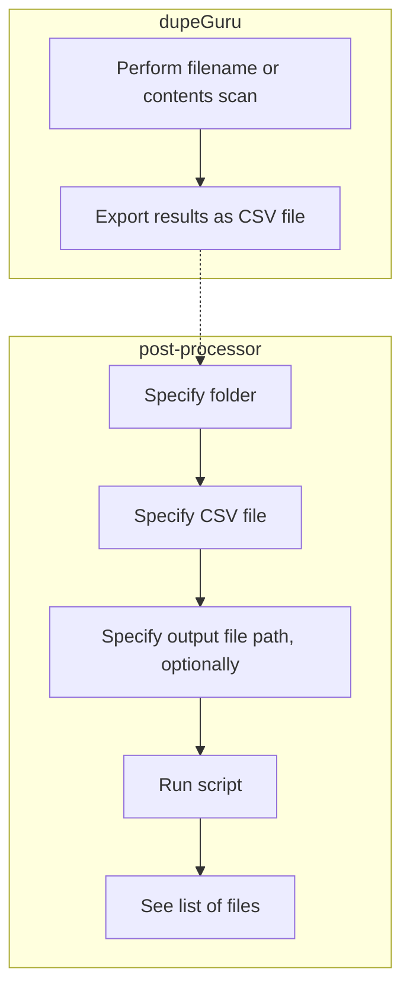

# dupeguru-post-processor

`dupeguru-post-processor` is a Python script that can be used to compare a folder on your computer to a set of dupeGuru results. Specifically, it can be used to determine which files in the folder are not listed in the CSV file; effectively, identifying the files of which dupeGuru found _no_ duplicates.

[dupeGuru](https://github.com/arsenetar/dupeguru) is a tool that can be used to identify duplicate files among two or more folders. The creation of this "post-processing" script was inspired by [this GitHub issue](https://github.com/arsenetar/dupeguru/issues/218).

# Workflow



This script was developed using Python version `3.10.5`.

# Usage

Display usage information:

```shell
$ python main.py --help                                                                                                                                                                                                                                 
usage: main.py [-h] [--output_csv_file PATH] [--log_level LEVEL] folder csv_file

Compares a folder to a CSV file exported from dupeGuru. Displays the differences on the console (default) or writes them to a CSV file.

positional arguments:
  folder                path to the folder with which you want to compare the CSV file exported from dupeGuru
  csv_file              path to the CSV file exported from dupeGuru

options:
  -h, --help            show this help message and exit
  --output_csv_file PATH
                        if you use this option, the script will generate a CSV file at the path you specify; otherwise, the script will display the results on the console
  --log_level LEVEL     specify a logging level for the script
```

> Note: File and folder paths can be absolute paths and/or relative paths.

### Example:

```shell
$ python main.py /path/to/folder/ ./some/dupelist.csv --output_csv_file /temp/nondupes.csv --log_level INFO
``` 
> When invoked with the example options shown above, the Python script will: (a) compare the set of file paths within the folder, `/path/to/folder`, to (b) the set of file paths listed in the CSV file, `./some/dupelist.csv`, and (c) write the results in CSV format to the file, `./results/nondupes.csv`, all while (d) displaying any log entries whose log level is at least `INFO`.

# Testing

Run the unit tests:

```shell
$ python -m unittest
```