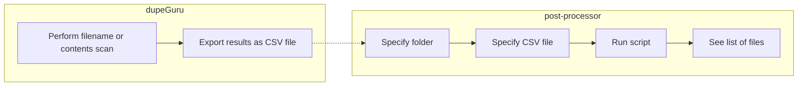
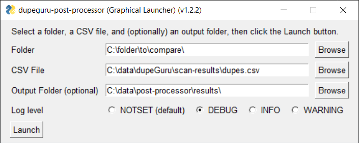

# dupeguru-post-processor

`dupeguru-post-processor` is a Python script that can be used to compare a folder on your computer to a set of dupeGuru results. Specifically, it can be used to determine which files in the folder are not listed in the CSV file; effectively, identifying the files of which dupeGuru found _no_ duplicates.

[dupeGuru](https://github.com/arsenetar/dupeguru) is a tool that can be used to identify duplicate files among two or more folders. The creation of this "post-processing" script was inspired by [this GitHub issue](https://github.com/arsenetar/dupeguru/issues/218).

# Workflow



# Usage

### Environment

This script was developed using Python version `3.10.5`.

### CLI
> **Note:** You can use the CLI without installing any dependencies, since all dependencies used by the CLI are included in the Python standard library.

Display usage information:

```shell
$ python main.py --help

usage: main.py [-h] [--output_csv_file PATH] [--log_level LEVEL] folder csv_file

Compares a folder to a CSV file exported from dupeGuru. Displays the differences 
on the console (default) or writes them to a CSV file.

positional arguments:
  folder                path to the folder with which you want to compare the CSV
                        file exported from dupeGuru
  csv_file              path to the CSV file exported from dupeGuru

options:
  -h, --help            show this help message and exit
  --output_csv_file PATH
                        if you use this option, the script will generate a CSV file
                        at the path you specify; otherwise, the script will display
                        the results on the console
  --log_level LEVEL     specify a logging level for the script
```

> Note: File and folder paths can be absolute paths and/or relative paths.

### Examples

Here are some example invocations of the script:

#### Display results on console

```shell
$ python main.py /path/to/folder/ ./some/dupelist.csv
``` 

#### Save results to a CSV file and display debug information

```shell
$ python main.py /path/to/folder/ ./some/dupelist.csv --output_csv_file /temp/nondupes.csv --log_level DEBUG
``` 

### GUI

The GUI was created as an "afterthought" to the CLI and is targeted at users who are already familiar with the CLI options, but don't want to type filesystem paths onto the command line.

Install dependencies:

```shell
$ python -m pip install -r requirements.txt
```

Open the GUI:

```shell
$ python gui.py
```

Here's what the GUI looks like as of release `v1.2.1`:



# Testing

Run the unit tests:

```shell
$ python -m unittest
```
